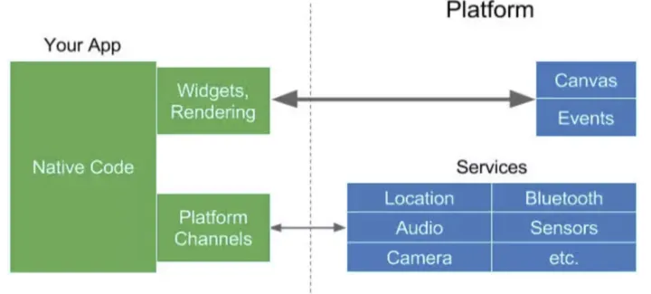
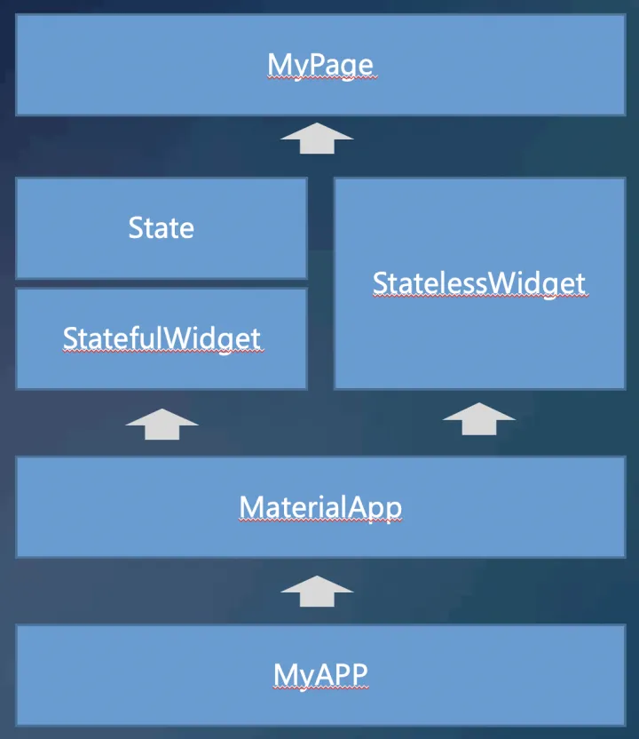
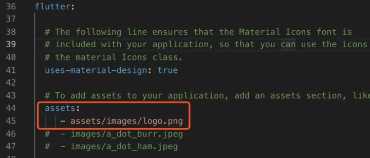

# 1.Flutter是啥玩意

Flutter是谷歌移动UI框架，可以快速在IOS和Android上构建高质量的原生用户界面


- 具有**跨平台**开发特性，支持IOS、Android、Web三端
- **热重载**特性大大提高了开发效率
- **自绘UI引擎**和编译成原生代码的方式，使得系统的运行时的**高性能**成为了可能
- 使用**Dart语言**,目前已经支持同事编译成Web端代码

# 2.移动端跨平台技术对比

## 2.3 Flutter



Flutter代码编译完成以后，直接就是原生代码，并且使用自绘UI引擎原生方式做渲染。
Flutter依赖一个 Skia 2D 图形化引擎，Skia也是Android平台和Chrom的底层引擎，所以性能完全不用担心。因为使用Dart做AOT编译成原生，自然比使用解释性的JS在V8引擎中执行性能更快，并且因为去掉Bridge，没有繁琐的数据通信和交换，性能更进一步。


# 3.Dart语言

对于前端同学，上手还是很容易，风格很像


# 4.环境配置

方便切换工具比如:proxifier

vsocode 插件安装Flutter和Dar


# 5.实践

> StatelessWidget:无状态变更，UI静态固化的Widget，页面渲染性能更高
> StatefuWidget:因为状态变更可以UI变更的Widget，涉及到数据渲染场景，都使用StatefulWidget.




# 6.路由

实际的项目，是有多个不同的页面的，页面之间的跳转，就要用到路由了。 我们增加一个list页面，点击Home页的“Click Me”按钮，跳转到列表页list。

```dart
import 'package:flutter/material.dart';

class ListPage extends StatelessWidget {
  @override
  Widget build(BuildContext context) {
    //定义列表widget的list
    List<Widget> list=<Widget>[];

    //Demo数据定义
    var data=[
      {"id":1,"title":"测试数据AAA","subtitle":"ASDFASDFASDF"},
      {"id":2,"title":"测试数据bbb","subtitle":"ASDFASDFASDF"},
      {"id":3,"title":"测试数据ccc","subtitle":"ASDFASDFASDF"},
      {"id":4,"title":"测试数据eee","subtitle":"ASDFASDFASDF"},
    ];

    //根据Demo数据，构造列表ListTile组件list
    for (var item in data) {
      print(item["title"]);

      list.add( ListTile( 
          title: Text(item["title"],style: TextStyle(fontSize: 18.0) ),
          subtitle: Text(item["subtitle"]),
          leading:  Icon( Icons.fastfood, color:Colors.orange ),
          trailing: Icon(Icons.keyboard_arrow_right)
      ));
    }

    //返回整个页面
    return Scaffold(
      appBar: AppBar(
        title: Text("List Page"),
      ),
      body: Center(
        child: ListView(
          children: list,
        )
      ),
    );
  }
}

```

核心方法就是：**Navigator.push(context,MaterilaPageRoute)


多个路由就是，stateless,保存路由表


```dart
routes:{
    "ListPage":(context)=>ListPage(),
    "Page2":(context)=>MyHomePageState()
}
```


# 7.widget

Flutter提供了很多默认的组件，而每个组件都继承自widget。在Flutter眼里：**一切都是widget**

widget，作为可视化的UI组件，包含显示UI、功能交互两方面。大的widget，也可以由小的widget组合而成。


## 7.1 Text

```dart
Text{
    "Hello world",
    style:TextStyle(
        fontSize:50,
        fontWeight:FontWeight.bold,
        color:Color(0xFF0000ff)
    )
}

```

Text的样式，来自另外一个widget：TextStyle。而TextStyle里的color，又是另一个widget Color的实例。


## 7.2 Button

1. RaisedButton：凸起的按钮
2. FlatButton:扁平化按钮
3. OutlineButton:带边框按钮
4. IconButton:带图标按钮


## 7.3 Container--(类比div)

基础属性:width,height,color,child

```dart
body:Center{
    child:Container(
        color:Colors.blue,
        width:200,
        height:200,
        child:Text("Hello Container ",style:TextStyle(fontSize: 20,color: Colors.white)),
    )
}
```

还有margin，padding，transform


## 7.4 Image
网络图片加载

使用NetworkImage，可以做网络图片的加载

```dart
child:Image{
    image:NetworkImage(""),
    width:200.0
}
```


本地图片，，就稍微复杂一些，首先要把图片的路径配置，加入到之前说过的pubspec.yaml配置文件里去:



加载本地图片时候使用AssetImage
```dart
child:Image(
    image:AssetImage("asset/images/logo.png")
    width:200.0
)
```


# 8.布局
绘制一个完整的页面


## 8.1 Row&Colum&Center 行列轴布局
row行布局，col列布局，center居中布局

row、column是有多个children的widget，而center只要一个child的widget

```dart
Row(
    children:<Widget>[]
)
Column(
    children:<Widget>[]
)
Center(
    child:Text("hello")
)
```


## 8.2 Align角定位布局
常常在Container里，需要显示的内容在左上角、左下角、右上角。
 在html时代，使用CSS可以很容易的实现，但是flutter里，必须依赖Align 这个定位的Widget
 

 ```dart
child: Container(
           color: Colors.blue,
           width: 300,
           height: 200,
           child: Align(
                      alignment: Alignment.bottomRight,
                      child:Text("Hello Align ",style:TextStyle(fontSize: 20,color: Colors.white)),
                  )
        )

 ```

 ### 8.3 Stack&Positioned 绝对定位

当然还有绝对定位的需求，这在css里，使用position:absolute 就搞定了，但是flutter里，需要
借助stack+positioned两个widget一起组合使用

> Stack 支持元素堆叠
> Positioned:支持绝对定位


```dart
child:Stack(
              children: <Widget>[
                  Image.network("https://ossweb-img.qq.com/upload/adw/image/20191022/627bdf586e0de8a29d5a48b86700a790.jpeg"),
                  Positioned(
                    top: 20,
                    right: 10,
                    child:Image.asset("assets/images/logo.png",width:200.0)
                  )
              ],
            )

```

### 8.4 flex&Expanded 流式布局

flex流式布局，之前Row。Column，都是继承自flex，也属于流shi布局


> 如果轴向不确定，使用Flex，通过修改direction的值设定轴向
> 如果轴向已确定，使用Row，Column，布局更简洁，更有语义化

```dart
class FlexPage extends StatelessWidget {
  @override
  Widget build(BuildContext context) {
    return Scaffold(
      appBar: AppBar(title: Text("Flex Page")),
      body: Flex(
        direction: Axis.horizontal,
        children: <Widget>[
          Container(
            width: 30,
            height: 100,
            color: Colors.blue,
          ),
          Expanded(
              flex: 1,
              child: Container(
                height: 100.0,
                color: Colors.red,
              ))
        ],
      ),
    );
  }
}

```

# 9.动画

包括动画实现，也是一个Widget

## 9.1 简单动画:淡入淡出

```js
import 'package:flutter/material.dart';

class AnimatePage extends StatefulWidget {
  _AnimatePage createState() => _AnimatePage();
}

class _AnimatePage extends State<AnimatePage> {
  bool _visible = true;
  @override
  Widget build(BuildContext context) {
    return Scaffold(
        appBar: AppBar(
          title: Text("Animate Page"),
        ),
        body: Center(
          child: Column(
            children: <Widget>[
              AnimatedOpacity(
                opacity: _visible ? 1.0 : 0.0,
                duration: Duration(milliseconds: 1000),
                child: Image.asset("assets/images/logo.png"),
              ),
              RaisedButton(
                child: Text("显示隐藏"),
                onPressed: () {
                  setState(() {
                    _visible = !_visible;
                  });
                },
              ),
            ],
          ),
        ));
  }
}


```

# 10.http请求


# 10.1 HTTPClient


httpClient在dart.io库中，不需要引入第三方库就可以使用


```dart
import 'dart:convert';
import 'dart:io';

Future _getByHttpClient() async{
    //接口地址
    const url="https://www.demo.com/api";

    //定义httpClient
    HttpClient client = new HttpClient();
    //定义request
    HttpClientRequest request = await client.getUrl(Uri.parse(url));
    //定义reponse
    HttpClientResponse response = await request.close();
    //respinse返回的数据，是字符串
    String responseBody = await response.transform(utf8.decoder).join();
    //关闭httpClient
    client.close();
    //字符串需要转化为JSON
    var json= jsonDecode(responseBody);
    return json;

} 

```


## 10.2 简便写法使用类库

使用Dart.dev提供的第三方类库
需要先在pubspec.yaml添加类库应用

```yaml
dependencies:
  flutter:
    sdk: flutter
  json_annotation: ^2.0.0
  http: ^0.12.0+2
```


